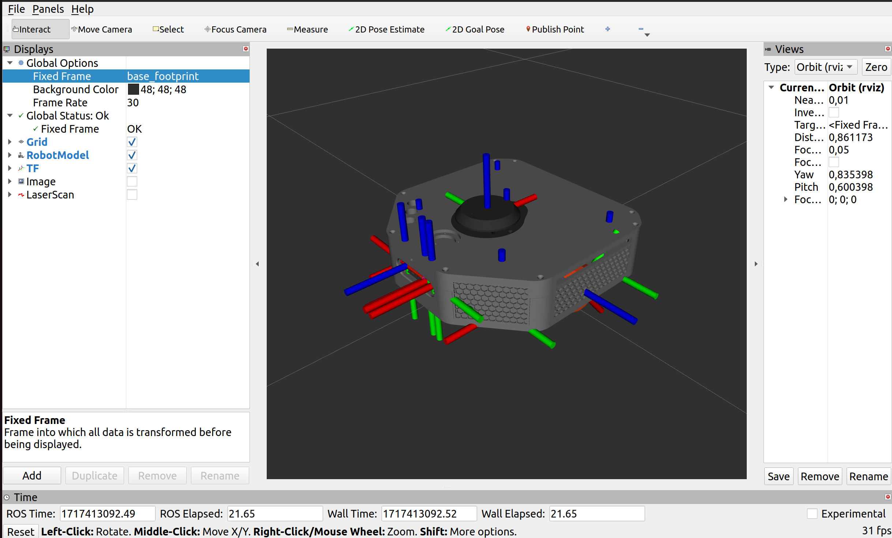

# ASTRO (Autonomous System for Teaching Robotics) ROS2 Package
This is a ROS2 Humble package for interfacing with an ASTRO robot.

## Installing ROS2 Humble

Make sure you are running Ubuntu 22.04. \
[ROS2 Humble Installation](https://docs.ros.org/en/humble/Installation/Ubuntu-Install-Debians.html)

## Configuring ROS2 Environment
[Configuring ROS 2 environment](https://docs.ros.org/en/humble/Tutorials/Configuring-ROS2-Environment.html)

## Creating a ROS2 workspace
[ROS2 Tutorials Creating a workspace](https://docs.ros.org/en/humble/Tutorials/Workspace/Creating-A-Workspace.html)

1. Example, creating a workspace named astro_ws:

    ```bash
    mkdir -p ~/astro_ws/src
    cd ~/astro_ws/src
    ```
## Install and compile ASTRO package

1. **Clone ASTRO package from GitHub**

    Make sure you are inside **astro_ws/src** folder (generally in **src** folder of your workspace).
    ```bash
    git clone -b ros2-humble https://github.com/AndrijaAdamovic/ASTRO.git
    ```
2. **Installing dependencies**

    Make sure you are now in your main workspace folder, in this example **~/astro_ws/** \
    Make sure you have [rosdep](https://docs.ros.org/en/humble/Tutorials/Intermediate/Rosdep.html) set-up.

    ```bash
    cd ~/astro_ws/
    rosdep install --from-paths src -y --ignore-src
    ```
3. **Building ASTRO package**

    Make sure you are still in your main workspace folder, in this example **~/astro_ws/**
    ```bash
    cd ~/astro_ws/
    colcon build --symlink-install
    ```

4. **Configuring package environment**

    If your ws is not named astro_ws, replace astro_ws with your ws name in the following commands. 

    **Bash (default):**
    ```bash
    echo "source astro_ws/install/setup.bash" >> ~/.bashrc
    source ~/.bashrc
    ```

    ***If using Zsh:***
    ```bash
    echo "source astro_ws/install/setup.zsh" >> ~/.zshrc
    source ~/.zshrc
    ```
## Usage
1. **Chaning RMW Implementation to Cyclone DDS** 

    For better data transfer between your PC and the ASTRO robot change RMW implementation to Cyclone DDS \

    **First method (suggested) (bash - default):**
    ```bash
    echo "export RMW_IMPLEMENTATION=rmw_cyclonedds_cpp" >> ~/.bashrc
    source ~/.bashrc
    ```

    *(If using zsh)* **First method (suggested) (zsh):**
    ```bash
    echo "export RMW_IMPLEMENTATION=rmw_cyclonedds_cpp" >> ~/.zshrc
    source ~/.zshrc
    ```

    ***Second method*** \
    If you don't want to have Cyclone DDS as your main RMW implementation, but just for one terminal 
    ```bash
    export RMW_IMPLEMENTATION=rmw_cyclonedds_cpp
    ```

2. **Configuring ROS_DOMAIN_ID** 

    First, make sure ASTRO Robot is switched on, and that you are on the same network as the robot. 

    Now, to work with an ASTRO robot, look up it's number, that number is the ROS_DOMAIN_ID. \

    E.G. For an ASTRO with a number 3:
    ```bash
    export ROS_DOMAIN_ID=3
    ```

    However, this will work for only one terminal, in every other terminal we must run the command above to have access to the robot. If you don't want to run the export command in every new terminal, do this. 

    **If using bash (default):**
    ```bash
    echo "export ROS_DOMAIN_ID=number of your ASTRO robot" >> ~/.bashrc
    source ~/.bashrc
    ```

    ***If using Zsh:***
    ```bash
    echo "export ROS_DOMAIN_ID=number of your ASTRO robot" >> ~/.zshrc
    source ~/.zshrc
    ```
3. **Starting Robot State Publisher**

    Now, with RMW implementation changed, and corresponding ROS_DOMAIN_ID exported, and your workspace sourced, execute:

    ```bash
    ros2 launch astro rsp.launch.py
    ```

    This will start Robot State Publisher for an ASTRO Robot. \
    You can now interface with ASTRO Robot via ROS2. \
    **Enjoy!** 

## Launch parameters

The *rsp.launch.py* launch file has a few launch parameters, to list them run:

```bash
ros2 launch astro rsp.launch.py --show-args
```

Example with a running ASTRO robot and *run_rviz:=true*:

```bash
ros2 launch astro rsp.launch.py run_rviz:=true
```

Output: \



    


